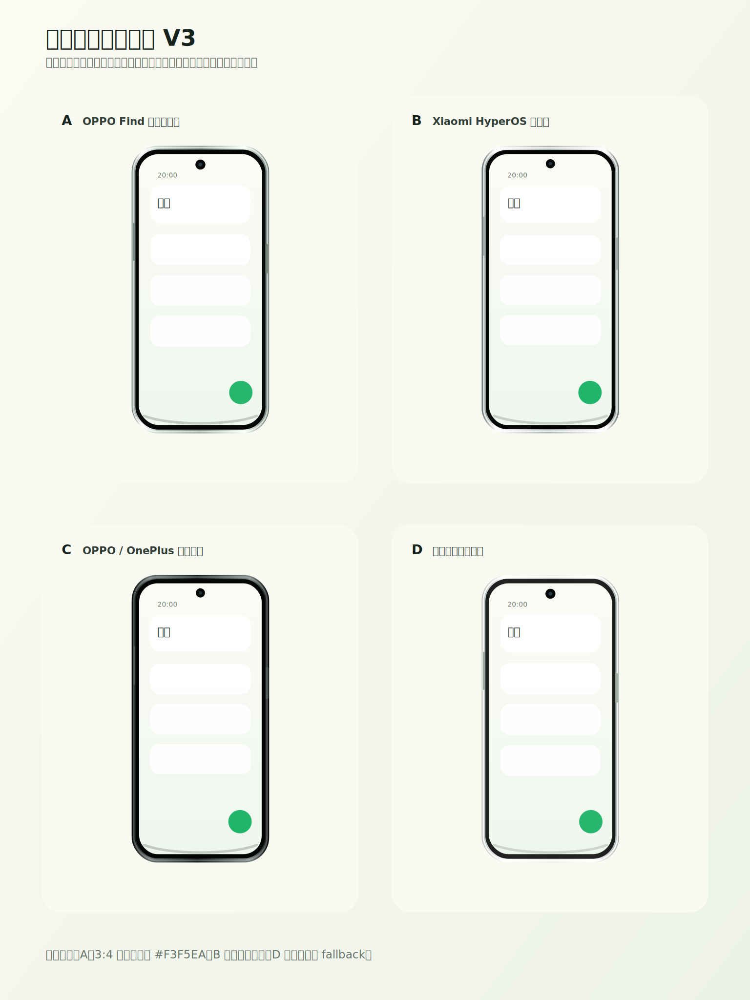
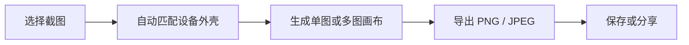
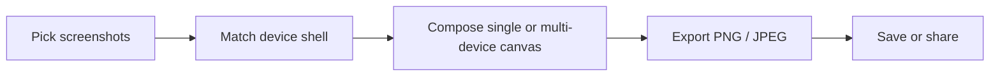

# DroidFrame

一款原生 Android 带壳截屏工具。导入手机截图后，DroidFrame 会离线匹配设备比例，套上轻量的程序化手机外壳，并导出适合分享、文档、应用商店说明页或社媒展示的 PNG/JPEG 图片。

Native Android screenshot framing tool. Import screenshots, wrap them in clean device shells, and export polished PNG/JPEG images for sharing, documentation, app listings, or social posts.



## 中文说明

### 功能特性

- 支持从 Android Photo Picker 批量导入截图。
- 支持从系统分享菜单接收单张或多张图片。
- 根据截图分辨率和宽高比离线匹配设备类型。
- 内置 Google Pixel、Samsung Galaxy、Xiaomi、OnePlus、vivo、OPPO 等设备的 frame manifest。
- 支持单设备画布和多设备按比例排版。
- 支持透明 PNG 和 JPEG 导出。
- 支持保存到 MediaStore，并通过 Android Sharesheet 分享。
- `:core` 模块为纯 Kotlin，包含 manifest 解析、设备匹配、布局和导出配置的单元测试。

### 使用方法



1. 下载并安装 APK。
   - 进入 [GitHub Releases](https://github.com/yaowencurry/droid-frame/releases)。
   - 下载最新版本的 APK。
   - 当前 `v0.3.2` 版本的附件名是 `app-release.apk`；后续版本会命名为 `DroidFrame-vX.Y.Z.apk`。

2. 导入截图。
   - 打开 DroidFrame，点击图片导入入口，从系统 Photo Picker 选择一张或多张截图。
   - 也可以在相册、文件管理器或其他应用里选择图片，然后通过系统分享菜单发送给 DroidFrame。

3. 生成带壳图。
   - App 会根据截图比例自动匹配接近的设备外壳。
   - 多张截图会进入多设备画布，保持截图之间的相对比例。
   - 当前版本使用程序化手机壳，避免直接依赖未授权的商业设备素材。

4. 导出和分享。
   - 需要透明背景时选择 PNG。
   - 需要更小文件体积或普通分享图时选择 JPEG。
   - 导出后可以保存到系统媒体库，也可以直接调起 Android 分享面板。

### 本地构建

安装 Android SDK，并在仓库根目录创建 `local.properties`：

```properties
sdk.dir=/path/to/Android/sdk
```

本机建议显式使用 Java 17：

```bash
JAVA_HOME=/opt/homebrew/opt/openjdk@17/libexec/openjdk.jdk/Contents/Home \
PATH="/opt/homebrew/opt/openjdk@17/libexec/openjdk.jdk/Contents/Home/bin:$PATH" \
./gradlew test :app:assembleDebug :app:assembleRelease
```

构建产物：

- Debug APK: `app/build/outputs/apk/debug/app-debug.apk`
- Release APK: `app/build/outputs/apk/release/app-release.apk`

不要提交 `build/`、`.gradle/` 或生成的 APK。APK 通过 GitHub Releases 发布。

### 发布 APK

APK 发布由 GitHub Actions 自动完成。更新版本号并提交后，推送一个 `v*` tag：

```bash
git tag v0.3.3
git push origin v0.3.3
```

workflow 会运行测试、构建 `:app:assembleRelease`，并把 APK 上传到 GitHub Release。后续版本的附件名会类似 `DroidFrame-v0.3.3.apk`。

### 素材策略

当前实现使用程序化设备外壳，frame manifest 已经保留替换授权 PNG 素材所需的结构：设备尺寸、截图安全区域、品牌/名称和颜色资产 ID。这样可以先保证离线可用和版权安全，后续再逐步替换为正式授权素材。

## English

### Features

- Import multiple screenshots through Android Photo Picker.
- Receive single or multiple images from Android share intents.
- Match device families offline using screenshot resolution and aspect ratio.
- Local frame manifest for Google Pixel, Samsung Galaxy, Xiaomi, OnePlus, vivo, and OPPO devices.
- Single-device canvas and proportional multi-device layouts.
- Transparent PNG and JPEG export.
- Save through MediaStore and share through Android Sharesheet.
- Pure Kotlin `:core` module with unit tests for manifest parsing, device matching, layout calculation, and export configuration.

### How To Use



1. Download and install the APK.
   - Open [GitHub Releases](https://github.com/yaowencurry/droid-frame/releases).
   - Download the latest APK asset.
   - The current `v0.3.2` asset is named `app-release.apk`; future releases will use names like `DroidFrame-vX.Y.Z.apk`.

2. Import screenshots.
   - Open DroidFrame and pick one or more screenshots from Android Photo Picker.
   - Or share images from Gallery, Files, or another app into DroidFrame through the Android share menu.

3. Generate framed screenshots.
   - DroidFrame automatically selects a close device shell based on screenshot dimensions.
   - Multiple screenshots are arranged on a proportional multi-device canvas.
   - The current release uses programmatic device shells to avoid relying on unlicensed commercial device assets.

4. Export and share.
   - Use PNG when you need a transparent background.
   - Use JPEG when you want a smaller regular sharing image.
   - Save the result to the media library or share it directly through Android Sharesheet.

### Local Build

Install Android SDK and create `local.properties` in the repository root:

```properties
sdk.dir=/path/to/Android/sdk
```

Use Java 17 explicitly on this machine:

```bash
JAVA_HOME=/opt/homebrew/opt/openjdk@17/libexec/openjdk.jdk/Contents/Home \
PATH="/opt/homebrew/opt/openjdk@17/libexec/openjdk.jdk/Contents/Home/bin:$PATH" \
./gradlew test :app:assembleDebug :app:assembleRelease
```

Build outputs:

- Debug APK: `app/build/outputs/apk/debug/app-debug.apk`
- Release APK: `app/build/outputs/apk/release/app-release.apk`

Do not commit `build/`, `.gradle/`, or generated APK files. APKs are distributed through GitHub Releases.

### Publish APK

APK publishing is handled by GitHub Actions. After bumping the app version and committing the change, push a `v*` tag:

```bash
git tag v0.3.3
git push origin v0.3.3
```

The workflow runs tests, builds `:app:assembleRelease`, and uploads the APK to GitHub Releases. Future assets will be named like `DroidFrame-v0.3.3.apk`.

### Asset Strategy

The first implementation renders high-quality programmatic device shells from the frame manifest. The manifest already includes the stable schema needed to replace those shells with licensed PNG frame assets later: device dimensions, screenshot safe area, brand/name, and color asset IDs.
